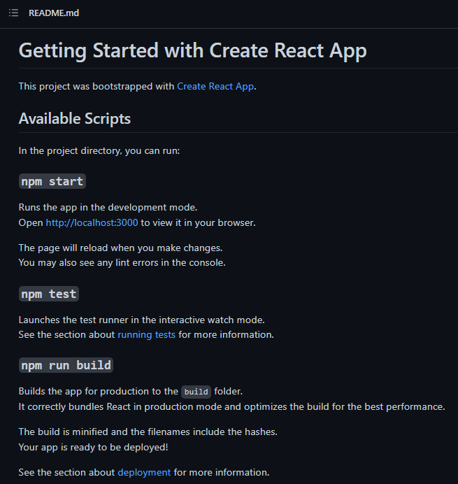
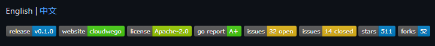

## What is a README file?

In the shortest explanation I can give; README files act as a guide that gives users a detailed description of a project you've worked on.

It can (and often should) include documentation with guidelines on how to use a project (_and how to install and run it!_).

## Why is a readme file important?

It's essential for you to know how to document your project in a README because:

- It's the first file a person, will see of your project. Be they a developer, recruiter, or even just someone looking for a solution to a problem. Thus it needs to begin simply, and then delve into the technical features later.
- It will make your project **_stand out_** to those that know what they're looking for, and be a nicer experience for those that don't
- Writing the initial details of your README before you begin on a large project can help you focus on what it is that you are trying to deliver with it.

While working on your project, bear in mind that you may need other developers to understand your code and what it does.
While it could be explained in the comments you leave in your code, they're useless if a developer goes to look for a better documented repository without opening the files.

---

### How to write a good README file

An important thing to note is that there is no singluar correct way to structure a good README, but there is one very wrong way - **not including one at all**.

Every day is a potential to learn, writing good documentation will not come without effort. It may be worth your time to browse GitHub repositories, and take a look at their README files.
You need not understand the topic or the code, but browsing [trending repositories](https://github.com/trending) and analyzing their structure could help you learn what makes a good README.

### What to include?

Before anything, you need to answer _what_, _why_ and _how_ of the project.

- What was your motivation to build a project?

  > Did you just hate the way twitter displayed tweets, so you decided to create your own, self-hosted twitter feed that pulls from their API?
  >
  > Did you want a digital calendar that you could truly call your own?
  > Were you just bored one day with some extra time, and decided to start creating a library for creating text based adventure games?

- Why did you build the project?
  > Building it for a small company in your community?
  >
  > Did a friend make a joke about something and you decided to make it real?

* What problem does the project solve?
* What makes your project stand out?

All these questions can help you figure out what should be included in the README

### Now to move on to what needs to be included in the README properly

1. Project Title
   > The name of the project, describing the entire thing in one sentence and explaining to people what the main goal and aim of the project is.
2. Project Description
   > While you may have given a brief explanation in point 1, you need to go deeper. The first point is meant to grab someones attention, here you need to show off. Explain in more detail what your project does, why you've used the technologies you have, some of the challenges you faced creating it, and some of the features you're looking to add in future versions.
3. Table of contents (sometimes)
   > If your readme is getting long, consider creating a table of contents. If you've managed to interest someone enough, they're likely going to come back at a later date to check your documentation. Make it easy on them, have a list here to click and jump to where they want to be.
4. How to install the project
   > If the project you're writing for needs to be run locally, say it's a Point-of-Sale application, or a Manufacturing Control software that needs to be running on a users network, you should provide step-by-step instructions to installing it. For instance, take a look at the README file created when you start a new React project
   > 
   > It includes small code snippets you can run in the terminal to run various scripts, from running in development mode, to building a final build for hosting.
5. How to use the project
   > I know this is banging on a bit now, but it really is crucial. A user that doesn't understand how to use your project is a user that will at best, not recommend your project be used. This could lead to lost opportunities if they happen to be talking to another developer or recruiter in their network, and advise avoiding your project.
   > If your project is complex, you should be utilising visual aids like screenshots and GIFs to help illustrate the workflow.
6. Credit your collaborators!
   > If you happen to work on a project as a team, or as part of an organisation, or even for an event you should be listing those that worked with you.
   > If you followed a tutorial to build a project that you usually wouldn't undertake, share a link to it here to allow for others to try and follow it too, share the knowledge!
   > Someone inspired you to toil in the code mines for it? They can go here too.
7. License (maybe)
   > Make it clear to other developers what they can and cannot do with your work, this should always be right near the end of your README file, this is forr the people who are REALLY interested in your project.
   > It's likely you won't delve into this for a long time yet, not until you're working on projects that could _probably_ be sold. When you get to this point though, take a look at [ChooseALicense](https://choosealicense.com)
   > It's a site that will help you choose a license that fits what you need. The most common license is GPL (General Public License) which allows others to make modifications to your code and use it for commercial uses.

### Additional README Sections

8. Badges!
   > So at this point we've reached the optional portion, badges give you a touch of additional flair, badges are an excellent way to do this.
   > Using [Shields.io](https://shields.io) you can get some suggested badges for your projects, here is an example from a [currently trending repository](https://github.com/cloudwego/hertz] at the time of writing that utilises a couple to show off, right at the start of their README
   > 
   > They're ideal to use if your repository is popular, and is being forked often. You can also use this [repository](https://github.com/Ileriayo/markdown-badges) to see what badges there are for you to use
   > One that may be useful to implement into some of the front end projects we have worked on thus far are:

9. How to contribute!

   > This is a section for if you're trying to create an open source project that you want other developers to be able to work on alongside you. Setting guidelines for what can be added to the project, and the process to do it. This also meshes with adding a license, as you'll want to make sure that the license you choose for an open source project is correct to avoid conflicts in the future.
   > For this, I suggest familiarising yourselves with the [Contributor Covenant](https://www.contributor-covenant.org) and [Contributor Guidelines](https://docs.github.com/en/communities/setting-up-your-project-for-healthy-contributions/setting-guidelines-for-repository-contributors). Having them available when launching an Open source project will be invaluable.

10. Include some tests!
    > Do this when you're confident in your code, write up some tests for your code and give a guide on how to run them. This shows that you're confident that your project will work flawlessly, and inspire that same confidence in others.

#### Final notes

Make sure to keep your README files up to date, there's nothing worse than following instructions to the letter, only for it to fail because someone didn't update the README like they should.

Should you be making a project that is useful globally, you may want to consider passing your README through a translator, to make it easier on non-english speaking readers. (Or if your project is important enough, getting it done professionally)

**With everything said and done, I'm now going to create a README for this README**

---

# A short guide to writing README files

This project was undertaken during a coding bootcamp, where I was asked to give a technical talk. I chose to write about README files, as I feel like the importance of them is often understated, despite them being a crucial aspect in new developers learning how to use libraries and frameworks.
