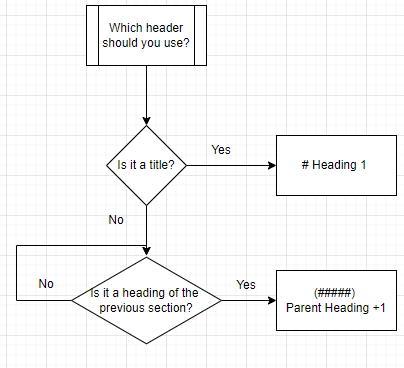

# Basic Markdown Syntax!

This introduction to syntax will be FAR from exhaustive, in the interest of time, I am only going to cover some basic utilities that you are most likely to want to use.
For a more in depth dive into the syntax that I haven't covered here, head to [GitHub's Markdown Documentation](https://docs.github.com/en/get-started/writing-on-github/getting-started-with-writing-and-formatting-on-github/basic-writing-and-formatting-syntax)

## Headings!

The first, and most important thing for a README file is headings.
Having clear, easy to find titles for sections is incredibly useful for anyone reading your documentation. For the most part, you should follow the following flowchart.


# Heading 1

```
# Heading 1
```

## Heading 2

```
## Heading 2
```

### Heading 3

```
### Heading 3
```

#### Heading 4

```
#### Heading 4
```

##### Heading 5

```
##### Heading 5
```

###### Heading 6

```
###### Heading 6
```

####### Heading 7V?

There are 6 levels of headings, which should be more than enough for any documentation.

## Styling text

An element of writing documentation is being able to style text using **bold**, _italics_, etc.

Note: To have a line break in markdown, you must leave an empty line in the markdown file like so:

Bold:
**This is a line of bold text**

```
**This is a line of bold text**
```

Italics:
_This is a line of italicised text_

```
_This is a line of italicised text_
```

Note: you can ALSO wrap a line of text in a single asterisk on either side to _italicise too._ Though this isn't necessarily best practice if you plan on using bold text too

Bold AND italics
**_This is a full block of text that is both bold and italicised_**

```
***This is a full block of text that is both bold and italicised***
```

Nested Italics:
**Nesting an _italic_ word**

```
**Nesting an _italic_ word**
```

Strikethrough:
~~Known issue: The thing does not work when X~~

```
~~Known issue: The thing does not work when X~~
```

<sub>A line of subscript</sub>
<sup>A line of superscript</sup>

```
<sub>A line of subscript</sub>
<sup>A line of superscript</sup>
```
